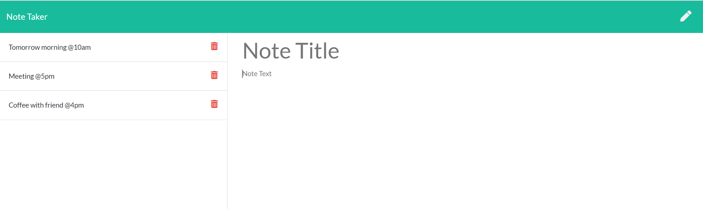

  # Title
  note-taker
  
  
  
  ## Table of contents 
  - [Description](#description)
  - [Installation](#installation)
  - [Usage Information](#usage-information)
  - [License](#license)
  - [Contribution Guidelines](#contribution-guidelines)
  - [Test Procedure](#test-procedure)
  - [Screenshot](#screenshot)
  - [Questions](#questions)
  
  ## Description
     The application which stores the important event, or any important session with title and description. For frontend html,js, css are used while for backend js, node, express as framework are used, and the result stores in db.json file in json format.

  ## Installation
     need to clone first the project then need to perform 'npm i', and after that run 'node server.js'on terminal

  ## Usage Information
     useful for storing the note for future, or save as happened events. 

  ## License
     MIT license
  
  ## Contribution Guidelines
     N/A

  ## Test Procedure
     N/A
     
  ## Screenshot
  

  ## Questions
    if you have questions then please feel free to contact on these addresses,
  Github: [SthaSub](https://github.com/SthaSub)
  
  Email: [subhashshrestha3@gmail.com](subhashshrestha3@gmail.com)
    